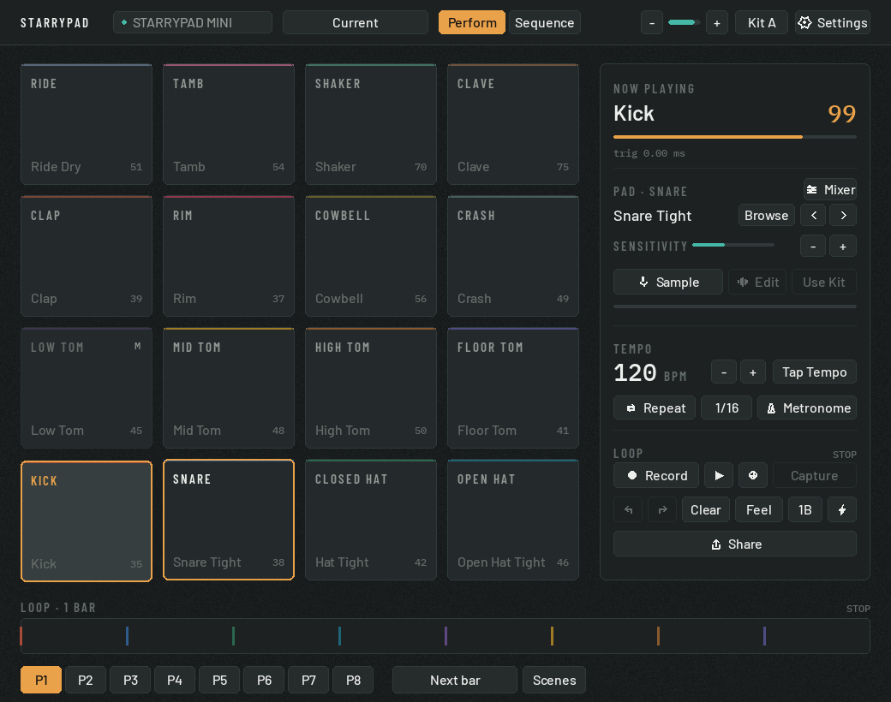

# Native USB Drum Pad

Local desktop drum app using pygame-ce, the platform MIDI API, and the trimmed Salamander Drumkit samples.

> **Windows and macOS.** `platform_backend.py` talks to WinMM on Windows and CoreMIDI on macOS through `ctypes`, and points SDL at WASAPI or CoreAudio to match. No extra dependency either way.



The panel is graphite and colour means state, not identity: amber marks the pad
sounding now, the pad selected, and an armed Record. Each pad keeps a 2px stripe
of its kit hue so the layout stays learnable. Every number is set in a monospace
face with tabular figures, so readouts do not jitter as they update.

## Requirements

- Windows 10 or later, or macOS 12 or later (Apple Silicon and Intel)
- Python 3.12 or later (numpy 2.5 does not build for 3.11)
- A class-compliant USB MIDI drum pad (developed against the Donner Starrypad)

No extra install step: the UI fonts ship in `assets/fonts/`, and every icon is
drawn from primitives at run time so it stays sharp at all three UI scales.

## Setup

Windows:

```bat
python -m venv .venv
.venv\Scripts\python -m pip install -r requirements.txt
```

macOS:

```sh
python3 -m venv .venv
.venv/bin/python -m pip install -r requirements.txt
```


The MIDI callback feeds a dedicated high-priority audio trigger thread. The UI runs independently at 60 FPS, so drawing cannot delay drum hits. The mixer provides 96-channel polyphony; only closed/open hi-hats share a choke group.

Run:

```bat
Start Native Drum Pad.bat
```

On macOS, double-click `start-native-drum-pad.command` in Finder or run:

```sh
./start-native-drum-pad.command
```

Controls:

- `Device`: cycle MIDI input devices.
- `DONNER` / `GM` / `Learn`: cycle Starrypad preset mapping mode.
- `Kit A` through `Kit D`: save and recall independent pad sounds and sensitivities.
- `Reset`: reset the current mapping mode.
- `+` / `-`: adjust volume.
- Click a pad to select it, then use the `Sound` arrows or `Sensitivity` controls.
- `Settings > Calibrate` learns three soft, natural, and hard hits plus duplicate-pulse spacing for the selected physical pad. Response and automatic dead time are stored per pad; setup is suggested only on the first MIDI connection.
- `Settings > Audio Setup` selects the output and switches between `Low latency` and `Stable`. Advanced settings expose 48/44.1 kHz and 64/128/256 sample buffers; failed changes restore the last working setup.
- The project name in the header opens New/Open/Recent/Save As/Collect. Projects autosave atomically, recover from a backup, and keep app/device preferences separate from musical content.
- Project Undo/Redo keeps up to 20 pad, kit, sample, sensitivity, and tempo edits; loop Undo/Redo also keeps 20 operations.
- `Feel` keeps original loop timing and offers Tight/Natural/Loose. Advanced controls expose Grid, Strength, Swing, Nudge, and deterministic Humanize; Reset restores the exact recorded timing.
- `Sequence` shows 16 pad rows and 16 steps per bar. Add/remove during playback, edit Velocity/Chance/Ratchet, nudge by 5 ms, copy, Shift-select ranges, and page through 1/2/4 bars. `Step Input` records physical pad Velocity at the cursor and advances automatically.
- Eight Pattern slots support queued `Next beat / Next bar / Pattern end` switching, Duplicate, and Double. `Scenes` builds a reusable Song order and advances at pattern boundaries without stopping playback.
- `Sample`: record from the selected audio input and assign the result to the selected pad.
- Sampling defaults to `Auto`: it waits for sound, keeps 200 ms of pre-roll, stops after sustained silence, and reports excessive input level. `Manual` remains available in Settings.
- `Use Kit Sound`: remove the custom assignment and return to the built-in kit sound.
- Drop an audio file onto the window to trim, normalize, convert, and assign it to the selected pad.
- `Edit` opens a non-destructive waveform editor for crop, zoom, normalize, reverse, fades, tune, A/B, and One-shot/Gate/Toggle/Loop playback.
- `Chop` splits a sample by transients, equal divisions, manual waveform marks, or live pad taps and expands it across available pads with optional play-through and choke behavior.
- Sample tempo detection includes Half/Double correction and either Repitch or pitch-preserving WSOLA Stretch that follows the project BPM.
- `Browse` keeps the pads visible while filtering built-in and user sounds by type, kit, favorites, recents, or search; preview is non-destructive and missing files can be batch relinked from one folder.
- MIDI Sync supports Auto/Internal/External clock source, 24 PPQN clock in/out, Start/Continue/Stop, output-port selection, and timing offset; external BPM is locked on the performance surface.
- `Settings`: choose MIDI input, mapping, sample/record start behavior, calibrate the selected pad, or view diagnostics hidden during normal performance.
- Sampling options include an opt-in low-level input Monitor and Multi mode for recording sequentially into unused pads; clipped takes wait for Keep or Record Again before assignment.
- `S`: start or stop sampling.
- `Repeat`: enable note repeat while a MIDI pad remains held.
- `1/8` / `1/16` / `1/16T` / `1/32`: cycle the repeat subdivision.
- `Metro`: toggle the audio-clock metronome.
- BPM `+` / `-` and `Tap Tempo`: set timing from 40 to 240 BPM.
- `N`: toggle Note Repeat. `M`: toggle the metronome.
- `Record`: replace the current loop and record for 1, 2, or 4 bars.
- Loop recording can start after a one-bar count, on the next playing bar, or instantly. Press Record again during the wait to cancel without clearing the existing loop.
- `Play`: start or stop loop playback. The spacebar provides the same control.
- `Overdub`: add hits to the playing loop without replacing it.
- `Capture`: recover the most recent pad performance without recording audio in the background.
- `Undo` / `Redo`: move backward or forward through loop edits, including Capture.
- `Q 1/16`: quantize loop hits to the current Note Repeat subdivision.
- `1B` / `2B` / `4B`: cycle the loop length.
- `Share`: export a 48 kHz stereo Master WAV, MIDI, aligned 16-pad stems, or a portable Project Bundle containing the project and its used samples.
- `Export MIDI`: write a Standard MIDI file using General MIDI drum notes.
- `L`: record. `O`: overdub. `C`: capture. `U`: undo. `Y`: redo. `Q`: quantize.
- `Esc`: quit.

## Design

| Module | Holds |
| --- | --- |
| `theme.py` | Every colour in the UI as a named token, plus the spacing and radius scale. Nothing draws with a raw RGB tuple. |
| `typeface.py` | The bundled faces. Barlow and Barlow Condensed for text and labels, IBM Plex Mono for all numbers, with a system CJK face behind them so Japanese MIDI port names render. |
| `icons.py` | 24 icons drawn as lines and polygons on a 16x16 grid. |
| `tools/make_assets.py` | Regenerates the grain tile and the app icons, including `starrypad.icns` and `starrypad.ico`. |

Fonts are Barlow, Barlow Condensed and IBM Plex Mono, all under the SIL Open
Font License; the licence texts sit beside them in `assets/fonts/`.

Performance behavior:

- Velocity below 50 remains audible when the controller sends the hit.
- Velocity around 70 uses the soft layer; velocity 100 and above uses the hard layer.
- Snare, hi-hat, and ride each provide four short, context-preserving timbre choices with layered velocity and round-robin playback.
- Five velocity zones crossfade at their boundaries; round-robin samples, subtle gain variation, and GM CC4 closed/semi/open hat articulation keep repetitions natural without real-time pitch processing on a hit.
- Kick, snare, toms, cymbals, and percussion can overlap without cutting each other off.
- The side panel shows MIDI-to-play p95/p99 trigger time, accepted hits, ignored MIDI events, maximum queue depth, and audio errors.
- Unknown MIDI events are ignored in `DONNER Mini` and `GM Drums` modes. Use `Learn` to assign nonstandard Note, CC, or Program Change events.
- Only one app instance can run at a time.
- Pad edits, Kit A-D, volume, mapping mode, BPM, and timing controls are stored in `drum_pad_settings.json`.
- Custom samples are automatically trimmed, normalized, faded, converted to 48 kHz stereo WAV, and stored in `user-samples`.
- Custom sample assignments are saved independently in Kit A-D.
- Loop events and bar length are restored on the next launch.
- The latest valid saved state is mirrored to a backup and restored automatically if the main settings file is damaged.
- The compact Pad Mixer provides Mix and FX tabs with per-pad volume, pan, tune, mute, solo, Punch/Air/Space macros, four bus assignments, multi-pad edits, undo, reset, and A/B comparison without covering the performance surface permanently. Master export is limiter-protected and the header only warns while live peaks overlap.
- Perform FX provides drag strips for Filter, Delay, Stutter, and Crush. Moves made while recording or overdubbing are replayed as loop automation, and Bounce Loop writes the running loop with its mix and FX to the next empty pad without stopping playback.
- The resizable interface supports 100/125/150% display sizes, aspect-safe arbitrary window sizes, standard project shortcuts, ordered keyboard focus, keyboard pad navigation, and delayed tooltips for symbol controls.
- Audio Setup includes a 10-second 16-pad dispatch test that returns a simple Low latency or Stable recommendation. Sleep/resume gaps trigger immediate panic and MIDI/audio health checks; a red Reconnect control appears only while a connection is unavailable.
- Built-in velocity variations avoid immediately repeating the same sample when alternatives are available.
- WAV and MIDI files are written to the `exports` folder.

Dependencies are pinned in `requirements.txt`.

Default mapping mode is `DONNER Mini`, covering chromatic pad presets such as `N20-N35`, `N36-N51`, and `N48-N63`. `GM Drums` maps common General MIDI drum notes such as kick `35/36`, snare `38/40`, hats `42/46`, crash `49`, and ride `51`. `Learn` maps incoming triggers in hit order.

## Tests

```bat
.venv\Scripts\python -m pytest test_drum_pad_native.py
```

## License

The source code is released under the [MIT License](LICENSE).

The audio samples under `samples/` are **not** MIT licensed. They are derived
from the [Salamander Drumkit](https://freepats.zenvoid.org/Drums/acoustic-drums-collection.html)
by Alexander Holm, licensed under [CC BY 3.0](https://creativecommons.org/licenses/by/3.0/),
and remain under those terms. See [LICENSE-SAMPLES](LICENSE-SAMPLES) for details.
